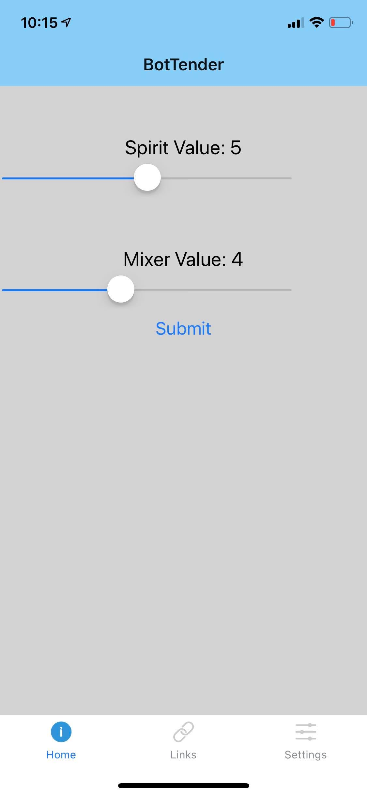

# IDD Final Project: ~~Pancake Printer~~ BotTender (Robo Drink Mixer)
### Ryan Curtis (rec284) & Alex Popeil (amp453)

  

## Original Idea: Pancake Printer
The pancake printer will have motors that control two axes suspended over the cook surface and controlled by the Pi. The batter flow will be controled by a servo motor and a camera to take pictures for the input, and a button to trigger the camera input. People will interact with the printer by posing in front of the camera, pressing the button to take a picture and start the printing. After the batter is done being printed, the user will have to flip the pancake and allow it to finish cooking before eating their face in pancake form.

### Paper Prototype:

  

## New Idea: Robo Drink Mixer: BOTtender
Because of the complexity of building the motor mechanism to time the batter dispersal and cost of purchasing all the necessary parts, we decided to pivot our efforts to building a robotic drink mixer, BOTtender. The user would interact through a mobile app to select the proportion of each drink/mixer and then click a button to send a request to the system. It will then pour the appropriate amounts for each liquid and the drink will be ready. To build this, we need a simple mobile app to take the user input that connects to a web socket provided by the Pi. The pi then sends this data to the arduino that controls the timing of each solonoid valve connected to a bottle containing each liquid and dispenses all the liquids in a single cup.

### New Paper Prototype

  

### State Diagram

  

### Parts Used
- [2 solonoid valves](https://www.youtube.com/redirect?q=http%3A%2F%2Famzn.to%2F2z9hpg3&redir_token=b63ZicTbiwcUp73I4HMTbfcTrKp8MTU3NjE4NzczM0AxNTc2MTAxMzMz&event=video_description&v=ioSYlxHlYdI)
- [4 module relay circuit](https://www.youtube.com/watch?v=0BNcI8jMcXE)
- [Diodes](https://www.youtube.com/redirect?q=http%3A%2F%2Famzn.to%2F2hIKeZz&redir_token=b63ZicTbiwcUp73I4HMTbfcTrKp8MTU3NjE4NzczM0AxNTc2MTAxMzMz&event=video_description&v=ioSYlxHlYdI)
- [12V Power Supply to control valves](https://www.youtube.com/redirect?q=http%3A%2F%2Famzn.to%2F2zbKp6O&redir_token=b63ZicTbiwcUp73I4HMTbfcTrKp8MTU3NjE4NzczM0AxNTc2MTAxMzMz&event=video_description&v=ioSYlxHlYdI)
- Arduino
- Raspberry Pi
- [Food-Safe Squeeze Bottles](https://smile.amazon.com/gp/product/B00OZOW6E0/ref=ppx_yo_dt_b_asin_title_o07_s00?ie=UTF8&psc=1)
- [Food-Safe tubing](https://smile.amazon.com/gp/product/B01CGVJ9OI/ref=ppx_yo_dt_b_asin_title_o07_s00?ie=UTF8&psc=1)

## Our Process
We based our circuit design and implementation on [this video](https://www.youtube.com/watch?v=ioSYlxHlYdI) for setting up the solonoid valves. They are connected to an arduinio running [this code](https://github.com/rec285/IDD_Final_Project/blob/master/bot_tender.ino) that accepts the input from the pi and controls the timing for opening and closing of the valves. The Raspberry Pi runs [this code](https://github.com/rec285/IDD_Final_Project/blob/master/server.js) based off Labs 6 and 7 to set up the websocket and takes input from the mobile app to push to the arduino. The mobile app uses [this code](https://github.com/rec285/IDD_Final_Project/tree/master/BotTender) to set up the interface and send the user selections over the web socket. We then attached bottles to each valve using the plastic tubes.

  

  

[Video of Solenoid Valves Working](https://youtu.be/vz8qwGRgB_o)
[Video of App Working](https://youtu.be/vz8qwGRgB_o)
[Video of Final Demo](https://youtu.be/vz8qwGRgB_o)
